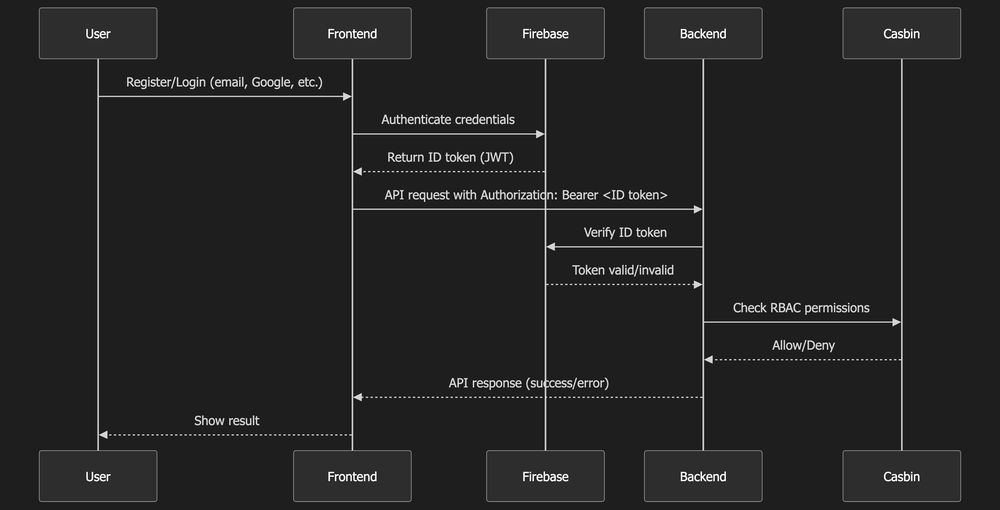

# Authentication System with Decentralized Identity (DID)

A robust authentication and authorization system built with Go (Fiber) and Next.js, featuring decentralized identity (DID), RBAC, and scalable architecture.

## Technologies Used

### Backend
- **Language:** Go (1.23.0+)
- **Framework:** Fiber
- **Database:** PostgreSQL (with PostGIS)
- **Cache:** Redis
- **Authorization:** Casbin
- **Authentication (Social/External):** Firebase Authentication
- **API Documentation:** Swagger (OpenAPI)
- **Configuration:** Viper
- **Logging:** Zap / OpenTelemetry (SigNoz)
- **Observability:** OpenTelemetry, SigNoz (ClickHouse, OTel Collector)
- **Containerization:** Docker, Docker Compose

### Frontend
- **Framework:** Next.js (v15.3+)
- **Language:** TypeScript
- **Package Manager:** Bun
- **UI Components:** shadcn/ui, Radix UI
- **Styling:** Tailwind CSS
- **State Management:** Zustand, TanStack Query (React Query)
- **Forms:** React Hook Form, Zod
- **API Client:** Axios
- **Authentication (Client-side):** Firebase Authentication, `react-firebase-hooks`
- **Linting:** ESLint

### Development Tools
- Make
- Git

## System Requirements

- Go 1.23.0 or higher
- Node.js (latest LTS, Bun manages Node environment)
- Bun (latest)
- Docker and Docker Compose
- Make (optional)

## Installation Guide

1. **Clone the repository:**
    ```bash
    git clone <your-repository-url>
    cd authentication-system-did
    ```

2. **Configure the environment:**
    ```bash
    cp .env.example .env
    cp config.example.yaml config.yaml
    ```
    Edit `.env` and `config.yaml` as needed (database, Redis, Firebase, SigNoz, etc.).

3. **Start dependent services:**
    ```bash
    make db-up
    ```

4. **Run database migrations:**
    ```bash
    make migrate
    ```

5. **Install frontend dependencies:**
    ```bash
    cd next
    bun install
    cd ..
    ```

6. **Generate Swagger documentation (optional):**
    ```bash
    make swag
    ```

## Configuration

- **Backend:** `config.yaml` (main), `.env` (environment variables)
- **Frontend:** `next/next.config.ts`, `.env.local` in `next/`
- **Firebase:** Set up a Firebase project and reference the service account key in backend config.
- **SigNoz:** Config in `config/signoz/`

## Usage Guide

### Running the Backend Server
```bash
make run
```
Backend runs on port from `config.yaml` (default: `8080`).  
Swagger: `http://localhost:<APP_PORT>/swagger/index.html`

### Running the Frontend Application
```bash
make client
```
Or:
```bash
cd next
bun dev
```
Frontend runs on port `3000` (default).

### Other Useful Make Commands
- `make build`: Build backend binary
- `make db-down`: Stop PostgreSQL and Redis containers
- `make seeder`: Run seeders to populate sample data

## Project Structure

```
.
├── cmd/
│   ├── seeder/       # Contains main.go, seed.go for data seeding
│   └── server/       # Contains main.go for starting the backend server
├── config/
│   ├── config.example.yaml # Example configuration for the application
│   └── rbac_model.conf     # Casbin RBAC model configuration
├── docs/                 # API documentation files (e.g., docs.go, swagger.yaml)
├── internal/
│   ├── app/
│   │   ├── dependencies/ # Application dependencies setup (dependencies.go)
│   │   ├── domains/      # Core domain models/logic (e.g., audit.go)
│   │   ├── middlewares/  # HTTP request middlewares (auth_middleware.go, 2fa_middleware.go, etc.)
│   │   └── routers/      # API route definitions (router.go)
│   ├── infra/
│   │   ├── cache/        # Caching infrastructure (e.g., redis_cache.go, provider.go)
│   │   ├── casbin/       # Casbin integration for RBAC (provider.go)
│   │   ├── config/       # Configuration loading and management (config.go, firebase_config.go)
│   │   ├── database/     # Database interaction (PostgreSQL models.go, database.go, provider.go)
│   │   ├── firebase/     # Firebase integration (firebase.go)
│   │   ├── jwt/          # JWT generation and validation services (jwt_service.go)
│   │   ├── messaging/    # Messaging queue infrastructure (content may be truncated)
│   │   └── tracer/       # Distributed tracing and observability setup (OpenTelemetry, provider.go)
│   ├── modules/          # Feature modules, each typically with domain/, handler/, port/, repository/, service/
│   │   ├── account/      # User account management (user_service.go, user_handler.go, etc.)
│   │   ├── app/          # General application utilities (health_handler.go, audit_service.go)
│   │   ├── auth/         # Authentication and authorization logic (auth_service.go, rbac_service.go, etc.)
│   │   ├── email/        # Email sending services and adapters
│   │   ├── notify/       # Notification services and adapters
│   │   ├── sms/          # SMS sending services and adapters
│   │   └── tenant/       # Multi-tenancy management
├── locales/                # Localization files (en.toml, vi.toml)
├── next/                   # Frontend Next.js application
│   ├── public/             # Static assets (images, fonts like next.svg, vercel.svg)
│   ├── src/                # Frontend source code
│   │   ├── app/            # Next.js App Router (layout.tsx, page.tsx, (protected)/, login/, etc.)
│   │   ├── components/     # Reusable UI components (auth/, layout/, ui/, etc.)
│   │   ├── contexts/       # React contexts (AuthContext.tsx)
│   │   ├── features/       # Feature-specific modules/components (profile/)
│   │   ├── hooks/          # Custom React hooks (useAuthGuard.ts, useRbac.ts, etc.)
│   │   ├── lib/            # Utility functions (utils.ts), API client (apiClient.ts), Firebase setup (firebase.ts)
│   │   ├── services/       # API service layers (authService.ts, userService.ts, etc.)
│   │   └── types/          # TypeScript type definitions (rbac.ts, tenant.ts, etc.)
│   ├── .gitignore          # Git ignore rules for the Next.js app
│   ├── bun.lockb           # Bun lockfile
│   ├── eslint.config.mjs   # ESLint configuration
│   ├── next.config.ts      # Next.js configuration
│   ├── postcss.config.mjs  # PostCSS configuration (for Tailwind CSS)
│   └── README.md           # README specific to the Next.js application
├── .gitignore              # Global Git ignore rules
├── docker-compose.yml      # Docker Compose configuration for services (DB, Cache)
├── go.mod                  # Go module definition
├── go.sum                  # Go module checksums
├── Makefile                # Make commands for common tasks (build, run, migrate)
├── README.md               # Main project README
└── sequence.png            # Diagram (e.g., authentication flow image)
```
(Note: The project structure is based on the currently available file list, which may be truncated in some subdirectories. Files like `next/package.json`, `next/tsconfig.json`, or specific configuration files like `config/signoz/*` might exist but were not detailed in the provided overview.)

## Authentication Flow

The authentication system uses Firebase Authentication for user identity and JWT for backend authorization. The flow integrates both frontend and backend for secure access control.

### Flow Overview

1. **User Registration/Login (Frontend):**
   - Users register or log in via the Next.js frontend using Firebase Authentication (supports email/password, Google, etc.).
   - On success, Firebase issues an ID token (JWT).

2. **Token Exchange (Frontend → Backend):**
   - The frontend sends the Firebase ID token to the backend (Go/Fiber) via API requests (usually in the `Authorization: Bearer <token>` header).

3. **Token Verification (Backend):**
   - The backend verifies the Firebase ID token using the Firebase Admin SDK.
   - If valid, the backend issues its own JWT (optional, for session management) or uses the Firebase token for further authorization.

4. **Session & Authorization:**
   - Backend uses middleware to validate tokens on protected routes.
   - Casbin is used for RBAC (Role-Based Access Control) to check user permissions.
   - Multi-tenancy and 2FA are supported via additional middlewares.

5. **Access Granted/Denied:**
   - If authentication and authorization succeed, the user can access protected resources.
   - Otherwise, access is denied.

### Sequence Diagram



### Key Files

- **Frontend:**
  - `next/src/contexts/AuthContext.tsx`: Manages authentication state and user context.
  - `next/src/services/authService.ts`: Handles API requests related to authentication (login, registration, token exchange).
  - `next/src/hooks/useAuthGuard.ts`: Custom hook to protect routes requiring authentication.
  - `next/src/lib/firebase.ts`: Client-side Firebase setup.

- **Backend:**
  - `internal/app/middlewares/auth_middleware.go`: Core authentication middleware. Verifies Firebase ID tokens and potentially issues/validates local JWTs. Likely integrates RBAC checks using Casbin.
  - `internal/infra/casbin/provider.go`: Sets up the Casbin enforcer for Role-Based Access Control.
  - `config/rbac_model.conf`: Defines the RBAC model (PERM) used by Casbin.
  - `internal/infra/firebase/firebase.go`: Handles Firebase Admin SDK setup and server-side token verification.
  - `internal/infra/jwt/jwt_service.go`: Service for managing local JWTs (if the system uses its own JWTs in addition to or instead of Firebase tokens for backend sessions).
  - `internal/modules/auth/service/auth_service.go`: Contains business logic for authentication processes.
  - `internal/modules/auth/service/rbac_service.go`: Contains business logic related to RBAC operations (e.g., managing roles, permissions).
  - `internal/modules/auth/handler/auth_handler.go`: HTTP handlers for authentication-related API endpoints.
  - `internal/modules/auth/handler/rbac_handler.go`: HTTP handlers for RBAC management API endpoints.

### Notes

- Social login and multi-tenancy are supported.
- 2FA can be enabled for additional security.
- All sensitive operations require valid authentication and authorization.

## API Reference

API docs available at:  
`http://localhost:<APP_PORT>/swagger/index.html`  
(Replace `<APP_PORT>` with backend port, default: `8080`)

## Contributing

Contributions are welcome! Please open issues or pull requests for improvements or bug fixes.

## License

Specify your license here (e.g., MIT, Apache 2.0).
